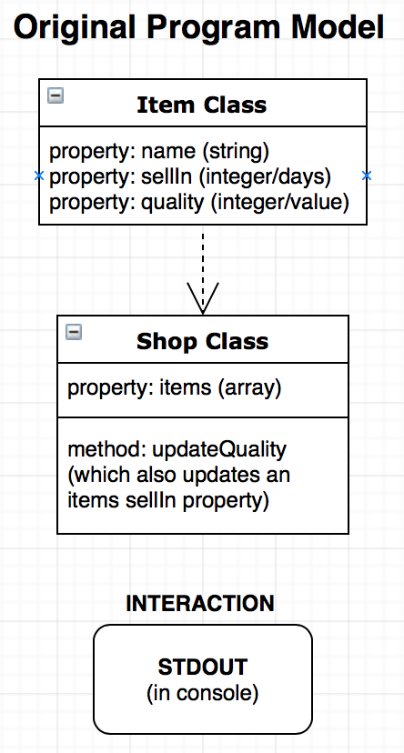

# Gilded Rose Tech Test

This is a well known kata developed by Terry Hughes. This is commonly used as a tech test to assess a candidate's ability to read, refactor and extend legacy code.

## Program Specifications

Hi and welcome to team Gilded Rose. As you know, we are a small inn with a prime location in a prominent city run by a friendly innkeeper named Allison. We also buy and sell only the finest goods. Unfortunately, our goods are constantly degrading in quality as they approach their sell by date. We have a system in place that updates our inventory for us. It was developed by a no-nonsense type named Leeroy, who has moved on to new adventures. Your task is to add the new feature to our system so that we can begin selling a new category of items. First an introduction to our system:

All items have a SellIn value which denotes the number of days we have to sell the item. All items have a Quality value which denotes how valuable the item is. At the end of each day our system lowers both values for every item. Pretty simple, right? Well this is where it gets interesting:

* Once the sell by date has passed, Quality degrades twice as fast.
* The Quality of an item is never negative.
* “Aged Brie” actually increases in Quality the older it gets.
* The Quality of an item is never more than 50
* “Sulfuras”, being a legendary item, never has to be sold or decreases in Quality
* “Backstage passes”, like aged brie, increases in Quality as it’s SellIn value approaches; Quality increases by 2 when there are 10 days or less and by 3 when there are 5 days or less but Quality drops to 0 after the concert

**We have recently signed a supplier of conjured items. This requires an update to our system:**

* “Conjured” items degrade in Quality twice as fast as normal items.

Feel free to make any changes to the UpdateQuality method and add any new code as long as everything still works correctly. However, do not alter the Item class or Items property as those belong to the goblin in the corner who will insta-rage and one-shot you as he doesn’t believe in shared code ownership (you can make the UpdateQuality method and Items property static if you like, we’ll cover for you)."

## The Brief

Choose legacy code (translated by Emily Bache) in the language of your choice. The aim is to practice good design in the language of your choice. Refactor the code in such a way that adding the new "conjured" functionality is easy.

## Program Description

* **Code Language**: Javascript
* **Testing**: Jasmine  

## Default (BAD) Program Model

## My Process

I approached the problem by familiarising myself with the specifications and mapping out a basic representation of the program logic (see diagram above). The issues with the original program was that all the operations were performed by one method in one class (no SRP) as well as only 1 unit test.

I proceeded by writing unit tests for the Shop class: first for standard items, then through vintage items (Aged Brie, Backstage passes) and finally legendary items. I also wrote tests for all edge cases (ie. sellIn date less than 0, quality of item cannot be over 50).

After writing and passing unit tests, I refactored the UpdateQuality method by extracting patterns in the code and creating other methods out of them. I implemented the new methods into the logic by working my way through the original code and maintaining passing tests.

Finally, I implemented the new 'Conjured item' feature in which quality degrades twice as fast as standard items. I did this by adding a two new methods: *isConjuredItem* and *updateConjuredItemQuality* and then implementing those methods into the code logic.

See below for a flow diagram that outlines the iteration loop for each item in the shop and how they are updated.

 
